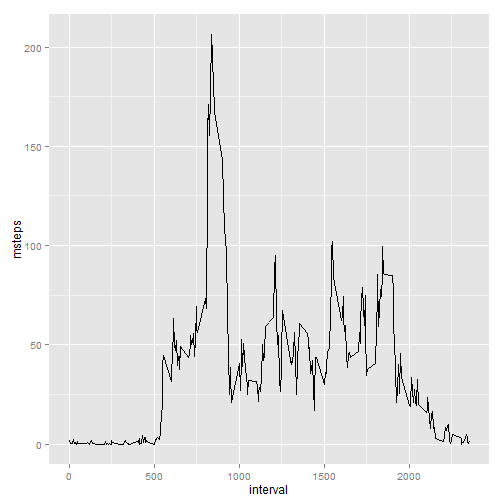
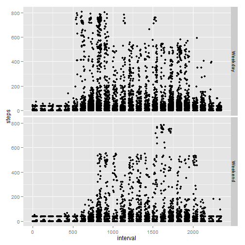

## Loading and preprocessing the data


Load csv

```r
library(knitr)
steps = read.csv("activity.csv")
opts_chunk$set(cache=TRUE)
```

## What is mean total number of steps taken per day?
Load packages

```r
library(ggplot2)
library(lubridate)
```

Split date column into day, month, year

```r
steps$day = day(steps$date)
steps$month = month(steps$date)
steps$year  = year(steps$date)
```

The mean of the totals steps taken per day is below

```r
mean(steps$steps, na.rm = T)
```

```
## [1] 37.38
```

```r
median(steps$steps, na.rm = T)
```

```
## [1] 0
```

## What is the average daily activity pattern?

```r
library(plyr)
avgsteps = ddply(steps, .(interval), summarise, msteps = mean(steps, na.rm = T))
ggplot(avgsteps, aes(x = interval, y=msteps)) + geom_line()
```

 

## Imputing missing values
All missing values will equal global average

```r
steps$steps[is.na(steps$steps)] = mean(steps$steps, na.rm = T)
```

## Are there differences in activity patterns between weekdays and weekends?

```r
weekend <- function(day){
  if (wday(day, label = T) %in% c("Sun", "Sat")){
    return("Weekend")
    }
  return("Weekday")
}
steps = ddply(steps, .(date,interval), transform, day = weekend(date))

ggplot(steps, aes(x = interval, y = steps)) + facet_grid(day~.) + geom_point()
```

 


