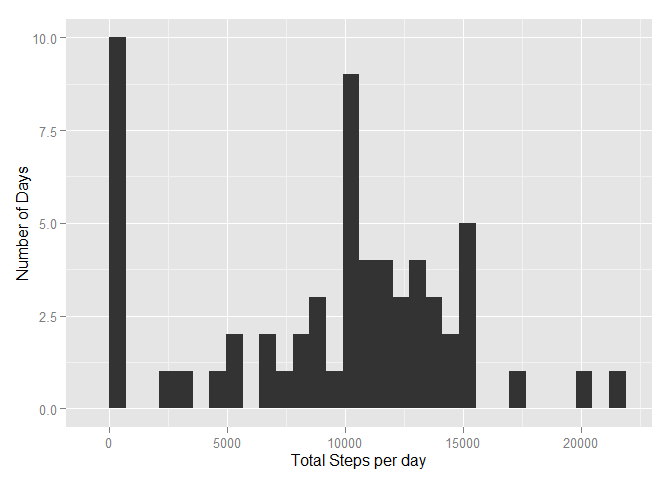
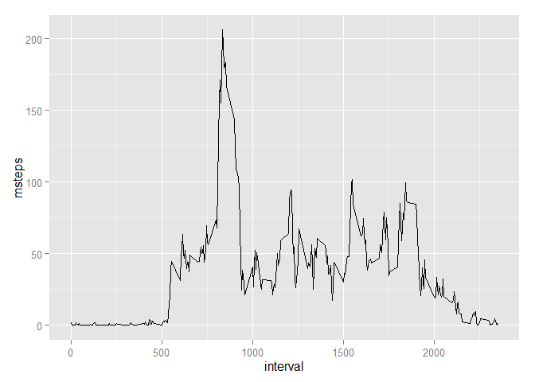
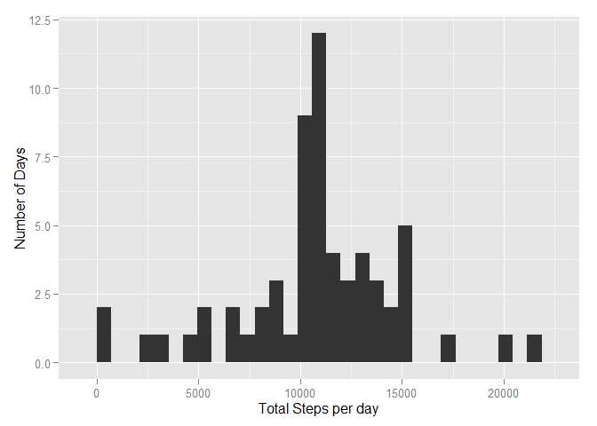
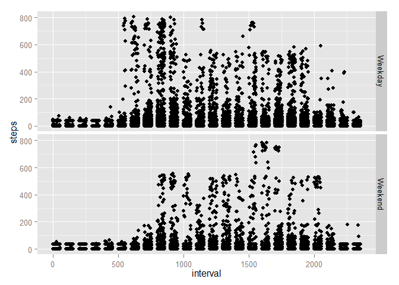

# Reproducible Research: Peer Assessment 1


## Loading and preprocessing the data


####Load csv and set options

```r
library(knitr)
opts_chunk$set(cache=TRUE)
steps = read.csv("activity.csv")
```

## What is mean total number of steps taken per day?
#### Load packages

```r
library(ggplot2)
library(lubridate)
library(plyr)
```

####Split date column into day, month, year

```r
steps$day = day(steps$date)
steps$month = month(steps$date)
steps$year  = year(steps$date)
```

####The mean of the totals steps taken per day is below

```r
mean(steps$steps, na.rm = T)
```

```
## [1] 37.38
```
##The median of the total number of steps is below

```r
median(steps$steps, na.rm = T)
```

```
## [1] 0
```

##Histogram of sum of steps per day

```r
qplot(ddply(steps, .(date),summarise, tsteps = sum(steps, na.rm = T))$tsteps,
      xlab ="Total Steps per day",
      ylab = "Number of Days")
```

```
## stat_bin: binwidth defaulted to range/30. Use 'binwidth = x' to adjust this.
```

 


## What is the average daily activity pattern?

```r
avgsteps = ddply(steps, .(interval), summarise, msteps = mean(steps, na.rm = T))
ggplot(avgsteps, aes(x = interval, y=msteps)) + geom_line()
```

 

#### The most steps on average takes place during this interval

```r
avgsteps$interval[avgsteps$msteps == max(avgsteps$msteps)]
```

```
## [1] 835
```

## Imputing missing values
####All missing values will equal global average

```r
steps$steps[is.na(steps$steps)] = mean(steps$steps, na.rm = T)
```


```r
qplot(ddply(steps, .(date),summarise, tsteps = sum(steps, na.rm = T))$tsteps,
      xlab ="Total Steps per day",
      ylab = "Number of Days")
```

```
## stat_bin: binwidth defaulted to range/30. Use 'binwidth = x' to adjust this.
```

 

```r
mean(steps$steps, na.rm = T)
```

```
## [1] 37.38
```

```r
median(steps$steps, na.rm = T)
```

```
## [1] 0
```

```r
avgsteps = ddply(steps, .(interval), summarise, msteps = mean(steps, na.rm = T))
ggplot(avgsteps, aes(x = interval, y=msteps)) + geom_line()
```

 


## Are there differences in activity patterns between weekdays and weekends?

```r
weekend <- function(day){
  if (wday(day, label = T) %in% c("Sun", "Sat")){
    return("Weekend")
    }
  return("Weekday")
}

#Number of steps over given interval
steps2 = ddply(steps, .(date,interval), transform, weekday = weekend(date))
steps2 = ddply(steps2, .(weekday,interval), summarise, avgsteps = mean(steps))


ggplot(steps2, aes(x = interval, y = avgsteps)) + facet_grid(weekday~.) + geom_line()
```

 


