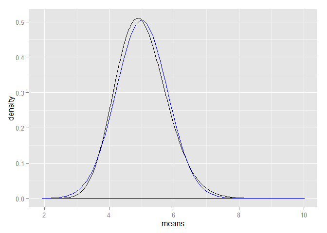

# Statistical Inference Course Project


```r
lambda = .2
n = 40
sim = 10000000
```

Simulating the mean of a thousand trials


```r
set.seed(1)
means = replicate(sim, expr = mean(rexp(n,lambda)))
```
Theoretical Distribution Mean

```r
1/lambda
```

```
## [1] 5
```
Simulated Mean

```r
mean(means)
```

```
## [1] 5
```
As you can see the results are quite close

Similarly
Theoretical Variance

```r
1/lambda^2
```

```
## [1] 25
```


```r
var(means)*n
```

```
## [1] 25.02
```


```r
library(ggplot2)
ggplot(data.frame(means), aes(x=means)) + geom_density() + stat_function(fun = dnorm, colour ="blue", arg = list(mean = 1/lambda, sd=sqrt(lambda^-2/n)))
```

 

Estimating the confidence intervals of the mean

```r
mean(means) + c(-1,1)*sd(means)/sqrt(40)*qnorm(.975)
```

```
## [1] 4.755 5.245
```

```r
sqrt(lambda^-2/n)
```

```
## [1] 0.7906
```


